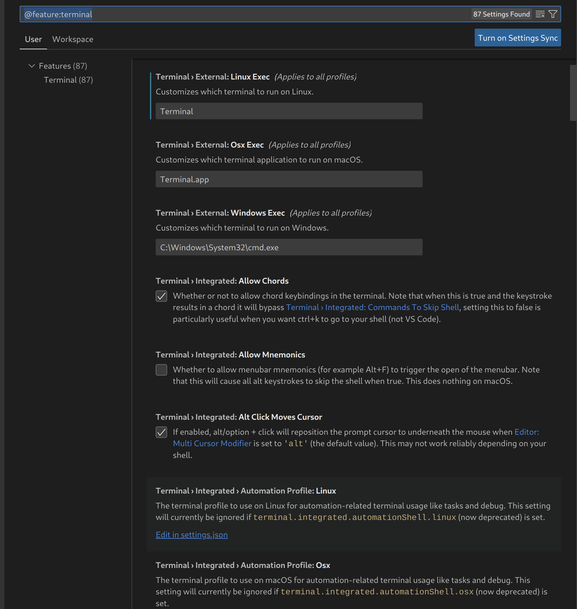
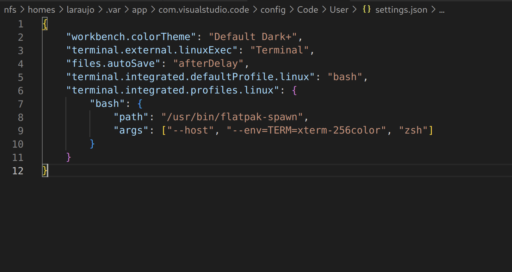

# 42_vscode_terminal

`cat /app/share/vscode/flatpak-warning.txt`

VsCode : Edit in settings.json



add : 
```
    "terminal.integrated.defaultProfile.linux": "bash",
    "terminal.integrated.profiles.linux": {
        "bash": {
            "path": "/usr/bin/flatpak-spawn",
            "args": ["--host", "--env=TERM=xterm-256color", "zsh"]
        }
    }
```



Restart VsCode and kill Terminal + new termial
